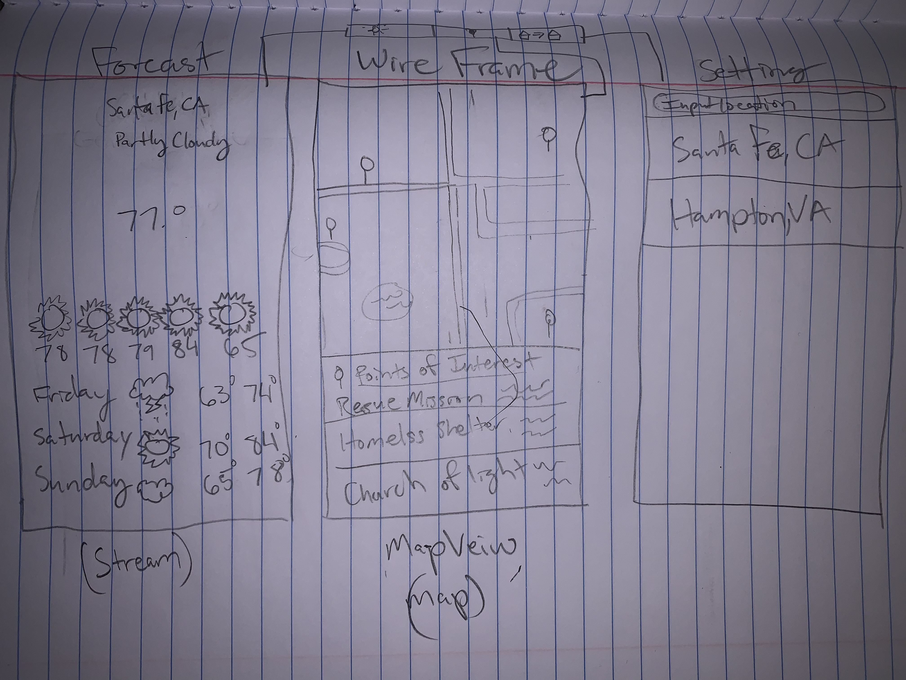

Original App Design Project - README Template
===

# StormCall

## Table of Contents
1. [Overview](#Overview)
1. [Product Spec](#Product-Spec)
1. [Wireframes](#Wireframes)
2. [Schema](#Schema)

## Overview
### Description
It is a weather application that will cater towards the general public viewing the potential forecast for the week wherever they are located at.

### App Evaluation
[Evaluation of your app across the following attributes]
- **Category:** Weather
- **Mobile:** Will pilot off moblie devices, but can intergrate towards web applications
- **Story:** User can utilize this app in there daily life. Users will check the weather, and will be notified of any inclement weather.
- **Market:** General Public
- **Habit:** This app will be used very frequently for knowing the weather impacts everyones decision making.
- **Scope:** Once the user opens the app, their location will be ping and will show them the weather.

## Product Spec

### 1. User Stories (Required and Optional)

**Required Must-have Stories**

* user can see the their location from
* User can see the general description of the weather (Partly Cloudy)
* User can see the temperature in Fahrenheit
* User can see weekly weather
* User can see image of weather description
* User can see the daily highs and lows of weather
* User can see hourly forecast
* User can see location of shelters
* User can get directions to shelters
* User can get phone number from shelter (if available)

**Optional Nice-to-have Stories**

* User can input another location for weather
* User can recieve weather in Celcius

### 2. Screen Archetypes

* Stream
   * user will receive live feed of weather weekly/hourly
* Detail
   * When inclement weather happens, user will see all surrounding storm shelters in their area
* Map View
   * user will see and interacted with pinged shelters
    * User will have access to phone number of shelter (if available)
    * User will have access to email of shelter (if available)
    * User can request directions to shelter (if available)

* Settings
   * User can input another location to see weather forcast
### 3. Navigation

**Tab Navigation** (Tab to Screen)

* Weather Forcast
* Map View 
* Settings

## Wireframes

## Schema 
[This section will be completed in Unit 9]
### Models
[Add table of models]
### Networking
- [Add list of network requests by screen ]
- [Create basic snippets for each Parse network request]
- [OPTIONAL: List endpoints if using existing API such as Yelp]

## Week 10 
[X] Found lottie animations for later use
[X] Implemented Network Request for OpenWeatherAPI
[X]Implemeted forcast structure for later use.

### App Walkthrough GIF
Part 1 Initial

 

##FEEDBACK 
I UNDERSTAND THAT WE'VE BEEN USING THE STORYBOARD INTERFACE BUT OUR TEAM DECIDED TO TAKE A DIFFERENT DIRECTION IN TERMS OF USING SWIFT UI. WOULD THERE BE ANY PROBLEMS MOVING 
FORWARD USING SWIFTUI INTERFACE? MODIFCATIONS WILL BE MADE ACCORDING TO YOUR ANSWER. 

Week 11
[X] Completed implementing city view models

This week we will start to include our weather animations inside the view constroller
